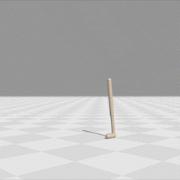

# ARIA: Archive Reproducibility Improvement Algorithm

ARIA is a plug-and-play approach that improves the reproducibility of solutions present in an archive. 
It can be applied to any set of solutions returned by a Quality-Diversity (QD) or Evolution Strategy (ES) algorithm. 
For more details, see our [paper on arXiv](https://arxiv.org/abs/2304.03672).

| Solution from MAP-Elites | After using ARIA | Solution from PGA-ME | After using ARIA |
|:------------------------:|:----------------:|:--------------------:|:----------------:|
|  |  |  |  |


## Installation

We require Python 3.10 or higher, and recommend to install the dependencies in a virtual environment.

1. First, create and activate a virtual environment:

```shell
python -m venv aria_env
source aria_env/bin/activate
```

2. Once the virtual environment is activated, install the required dependencies:

```shell
pip install -r requirements.txt
```

If you want to leverage hardware acceleration and run the code on your GPU, you can install JAX with CUDA support:

```shell
pip install -U "jax[cuda12]==<version_in_requirements.txt>"
```

## Usage

The general command structure to run the algorithm is:

```shell
python main.py +task=<task_name> +algo=<algorithm_name> task.seed=<seed> [additional_parameters]
```

### Tasks

- `arm`: A planar robotic arm task, where the goal is to reach different final positions with an 8 Degrees of Freedom (DoF) arm.
- `ant_omni`: An ant robot task, where a four-legged robot needs to reach diverse final positions.
- `walker_uni`: A bipedal walker task, where the goal is to find diverse ways to move forward as fast as possible.

### Algorithms

- `aria_es_init`: The Archive Reproducibility Improvement Algorithm (ARIA) initialized with a single genotype optimized via an Evolution Strategy (ES) algorithm.
- `aria_mapelites_init`: ARIA initialized with a MAP-Elites archive.
- `aria_pga_init`: ARIA initialized with a Policy Gradient Assisted MAP-Elites (PGA-ME) archive.
- `aria_linearcomb`: A variant of ARIA using a linear combination objective function. 
    This algorithm requires `algo.weight_fitness_obj=<value>`, where `<value>` balances the importance of the fitness and reproducibility objectives.
    That value should be between 0 and 1.
- `map_elites`: The standard MAP-Elites algorithm.
- `naive_sampling`: A baseline algorithm that uses naive sampling. Requires `algo.weight_fitness_obj=<value>` too.
- `mome_reproducibility`: Multi-Objective MAP-Elites with Reproducibility consideration.

Note: The `arm` task is incompatible with PGA-based algorithms (i.e., `aria_pga_init`).

## Main files and Code Structure

- `main.py`: The main script to run the algorithm.
- `aria/`: 
  - [`aria_es_init.py`](aria/aria_es_init.py): Implementation of ARIA initialized with an ES genotype.
  - [`aria_mapelites_init.py`](aria/aria_mapelites_init.py): Implementation of ARIA initialized with a MAP-Elites (or PGA-ME) archive.
  - [`reproducibility_improvers`](aria/reproducibility_improvers): Contains the optimizers used to improve the reproducibility of the archive.
  - [`algos`](aria/algos): Contains all baselines and algorithm factory

## Citing

If you use this work in your research, please cite our paper:

```bibtex
@inproceedings{grillotti2023aria,
  title={Don't bet on luck alone: Enhancing behavioral reproducibility of quality-diversity solutions in uncertain domains},
  author={Grillotti, Luca and Flageat, Manon and Lim, Bryan and Cully, Antoine},
  booktitle={Proceedings of the Genetic and Evolutionary Computation Conference},
  pages={156--164},
  year={2023}
}
```
